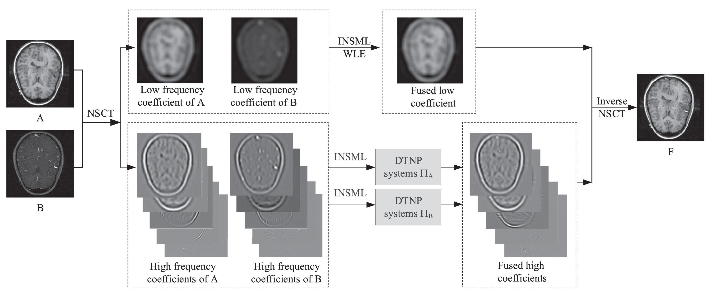

# A novel fusion method based on dynamic threshold neural P systems and nonsubsampled contourlet transform for multi-modality medical images
[Bo Li](https://github.com/MorvanLi/), Peng Hong*, Wang Jun  
Signal Processing (IF:4.662), Volume: 178,  January 2021  
[paper](https://doi.org/10.1016/j.sigpro.2020.107793)  

## Abstract

Dynamic threshold neural P systems (DTNP systems) are a distributed parallel computing model with an interesting mechanism involving the cooperative spiking of neurons in a local region. In this paper, this mechanism is combined with the nonsubsampled contourlet transform (NSCT) to develop a novel fusion method for multi-modality medical images. The complementary information of multi-modality images is extracted using an improved novel sum-modified Laplacian (INSML) feature, which is used in the fusion rules for the low-frequency NSCT coefficients. Moreover, the high-frequency NSCT coefficients are extracted using the WLE-INSML features, which are used to construct the fusion rules for these coefficients. The proposed fusion method is evaluated on an open dataset consisting of twelve pairs of multi-modality medical images. In addition, it is compared with nine previously reported fusion methods and four deep learning based fusion methods. The qualitative and quantitative experimental results demonstrate the advantage of the proposed fusion method in terms of the visual quality and fusion performance.

## Platform

matlab 2017b 

In 'main.m' file, you can run the code.

## Proposed framework



If you have any question about this code, feel free to reach me(morvanli@foxmail.com) 

## Experiments


## Citation

````
@article{LI2021107793,
title = {A novel fusion method based on dynamic threshold neural P systems and nonsubsampled contourlet transform for multi-modality medical images},
journal = {Signal Processing},
volume = {178},
pages = {107793},
year = {2021},
issn = {0165-1684},
year={2021},
publisher={Elsevier}
````

## Related Work

- Multi-focus image fusion based on dynamic threshold neural P systems and surfacelet transform[J]. Knowledge-Based Systems, 2020, 196, 105794.
  
  https://doi.org/10.1016/j.knosys.2020.105794
  
  
  
- Medical image fusion method based on coupled neural P systems in nonsubsampled shearlet transform domain[J]. International Journal of Neural Systems, 2021, 31(01): 2050050: 1-16.

  https://doi.org/10.1142/s0129065720500501

